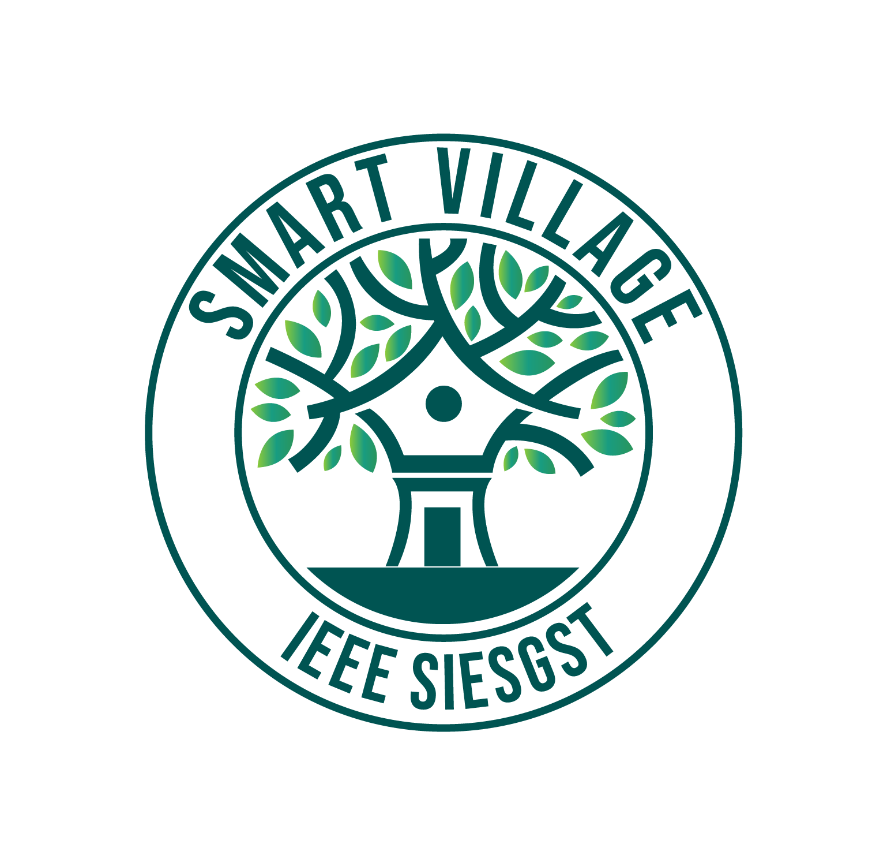

# IEEE SIESGST Smart Village Project

<a href='https://smartvillage.ieeesiesgst.in/'>
<p align="center">
   
</p>
</a>

## Setup & Installtion

Make sure you have the latest version of Python installed.

1. Fork this repo
2. Clone your forked repo from github
    ```bash
    git clone <forked-repo-url>
    ```
3. Set remote url
    ```bash
    git remote add upstream https://github.com/ieeesiesgst/ieeesiesgst-smart-village.git
    ```

## Local Environment setup

```bash
# 1. setup conda enironment
conda create --name <env_name> python
```
```bash
# 2. activate your environment 
conda activate <env_name>
```
```bash
# 3. Go to the cloned repo location & install the requirements
pip install -r requirements.txt
```
```bash
# 4. Set the isv creds. in the environment provided by project admin
```
```bash
# 5. Running The App
python main.py
```
```bash
# 6. Viewing The App
Go to http://localhost:5000/
```

---
 Project maintainer: [`@prathameshThakur`](https://github.com/prathameshThakur)
